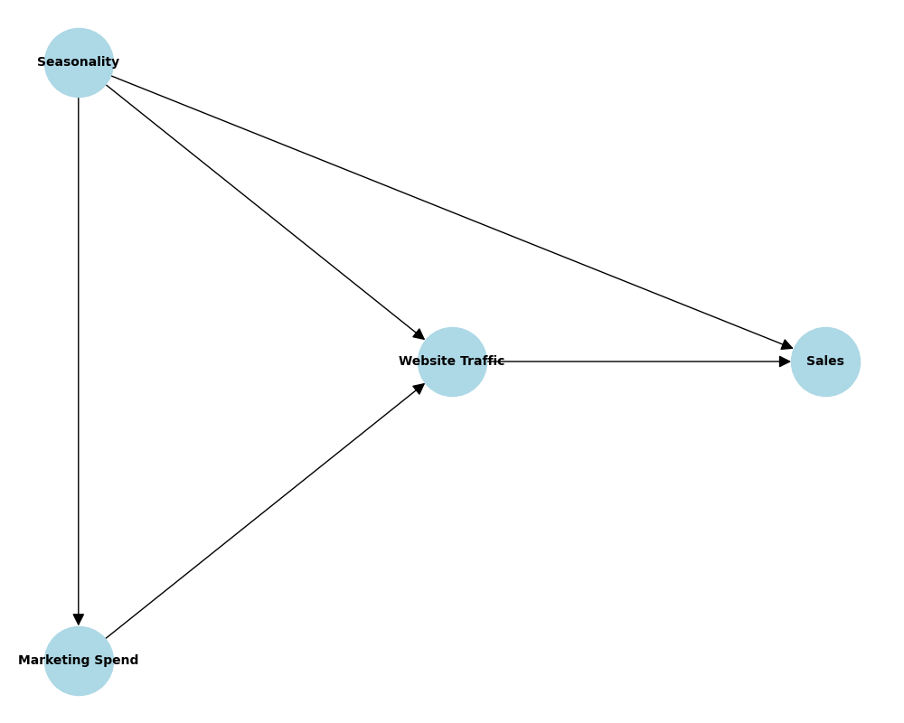
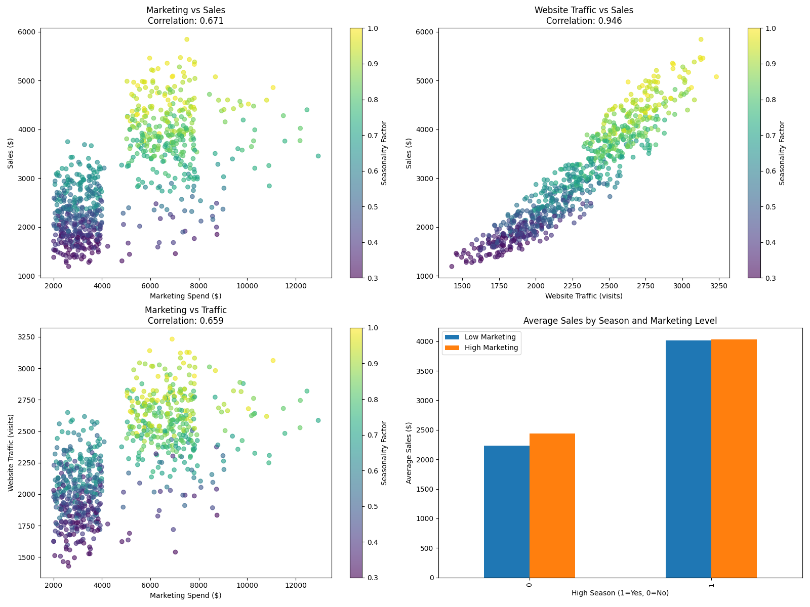
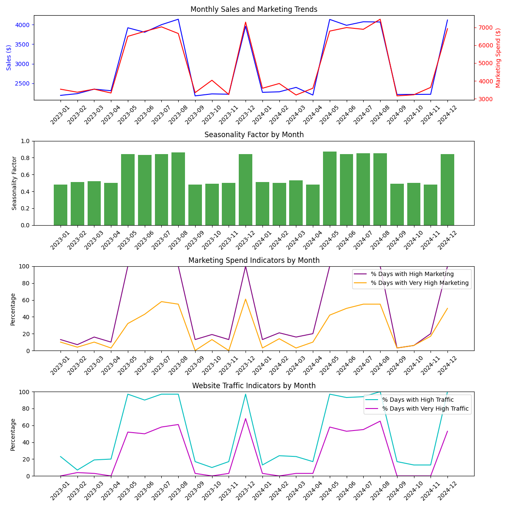

## Causal Diagram


## Data Analysis


## Data Analysis


## Sample Output
```
{
    1: month            0.968259
    v_holiday        0.010343
    v_email          0.004659
    v_influencer     0.003849
    v_launch         0.003722
    v_campaign       0.002841
    v_customer       0.001837
    v_awareness      0.001256
    v_promotion      0.001195
    v_boost          0.001068
    v_ads            0.000972
    v_standard       0.000000
    v_special        0.000000
    v_retention      0.000000
    v_social         0.000000
    v_season         0.000000
    v_school         0.000000
    v_sale           0.000000
    v_newsletter     0.000000
    v_program        0.000000
    v_product        0.000000
    v_partnership    0.000000
    v_media          0.000000
    v_display        0.000000
    v_brand          0.000000
    v_summer         0.000000
    dtype: float64
}
```
## What does it mean?

This output shows feature importance from the causalBert model that incorporates text data. Let me explain what it means:

The numbers represent the relative importance of each feature in determining the causal effect of high marketing spend on sales. The values sum to 1 (or 100%), indicating the proportional contribution of each feature.

### Key insights from this output:

* **Month dominance (96.83%):** `month` is overwhelmingly the most important feature, accounting for about 96.8% of the causal effect.
    * This confirms our understanding that seasonality (represented by `month`) is the primary causal factor affecting sales.
    * This makes sense in our simulated data where we explicitly built seasonality as a strong confounding variable.
* **Campaign type importance:** The features prefixed with `v_` are derived from the text in the campaign descriptions.
    * The model has broken down the campaign descriptions into individual words/terms and assessed their importance.
    * `v_holiday` has the second highest importance (1.03%), suggesting holiday-themed campaigns have some causal effect beyond just the month/season.
    * `v_email` (0.47%), `v_influencer` (0.38%), and `v_launch` (0.37%) show modest causal importance.
* **Zero importance features:** Many campaign-related features show zero importance (`v_standard`, `v_special`, `v_retention`, etc.).
    * This suggests these campaign elements don't have a measurable causal effect on sales after controlling for month/seasonality.
    * The model has determined these aspects of campaigns don't meaningfully contribute to the causal relationship.

### What this tells us for your presentation:

* **The power of causal analysis:** This shows how causal analysis can identify that what appears to be a strong marketing effect (in correlation analysis) is actually largely explained by seasonality.
* **Insight for marketing strategy:** You could demonstrate that while high marketing spend does have *some* causal effect, the bulk of sales variation comes from seasonality. The most effective strategy would focus marketing dollars on certain campaign types during key seasonal periods.
* **Specific campaign elements matter:** You could highlight that holiday-themed messaging, email campaigns, and influencer partnerships show measurable causal effects while other campaign elements don't.
* **Practical takeaway:** For your Google Next demonstration, this presents a compelling story: *"Traditional analytics might tell you to just spend more on marketing, but causal AI reveals that **when** and **how** you spend matters far more than **how much**."*

This is exactly the kind of insight that showcases the value of combining knowledge graphs and generative AI for causal reasoning - identifying the true drivers of business outcomes beyond simple correlations.